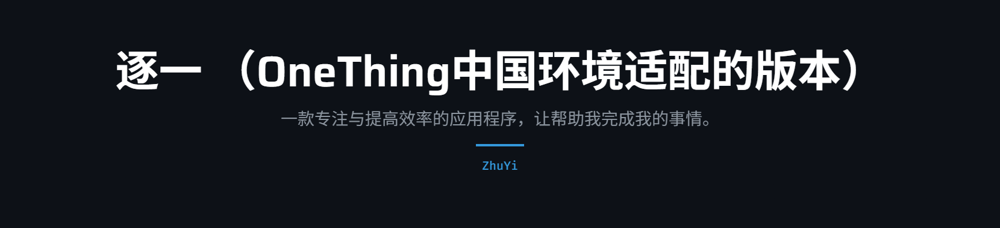
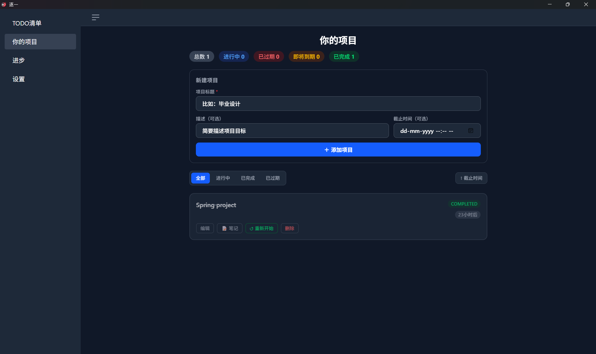
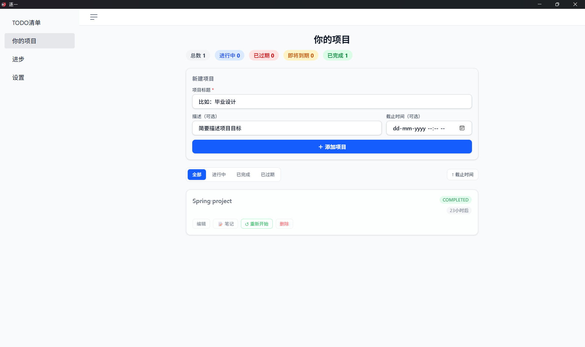

 


[](LICENSE)


---

欢迎来到**逐一** (ZhuYi)!

逐一（ZhuYi）是一个现代、极简的个人生产力工具。它的目标是帮助你通过清晰的任务管理、项目追踪和数据可视化来掌控你的每一天。支持离线优先架构，并已打包为跨平台桌面应用。

## 核心功能 (Core Features)

- ✅ **待办列表 (Todo)** —— 极简交互，支持任务的增删改查及状态切换。
- ✅ **数据存储升级 (IndexedDB)** —— **[NEW]** 成功从 `localStorage` 迁移至 `IndexedDB`，提供更稳固、海量的本地离线数据支持。
- ✅ **项目追踪 (Project Tracker)** —— 多项目并行管理、设定截止时间、内置轻量笔记系统。
- ✅ **进度看板 (Dashboard)** —— 直观的项目状态统计、整体进度可视化、临近到期预警，支持 CSV 数据导出。
- ✅ **UI 重塑与图标 (Vibrant UI)** —— **[NEW]** 全新红橙色系主题，全面集成 **Flowbite SVG** 图标库，视觉体验更专业。
- ✅ **桌面原生通知** —— 基于 Tauri v2 实现，任务完成或项目更新时实时弹出系统提醒。
- ✅ **专属设置页** —— 支持外观主题切换、字体大小调节及数据迁移重置。


## 技术栈 (Tech Stack)

* **框架**: SvelteKit 5 + Vite 7
* **样式**: Tailwind CSS 4 + Flowbite (flowbite-svelte)
* **存储**: IndexedDB (基于异步架构的离线优先存储)
* **桌面**: Tauri v2 + Rust (支持 Windows 原生安装包)
* **图标**: Flowbite Svelte Icons

## 界面预览

目前支持深色模式（默认）和浅色模式，采用全新的红橙色系（Primary Red-Orange）：

1. **深色主题 (Dark Mode)**


2. **浅色主题 (Light Mode)**


## 快速开始

1. **克隆仓库**
   ```bash
   git clone https://github.com/vk22006/ZhuYi.git
   cd ZhuYi
   ```

2. **安装依赖并运行**
   ```bash
   npm install
   npm run tauri:dev
   ```

3. **构建安装包**
   ```bash
   npm run tauri:build
   ```

## 项目现状 & 版本说明

* **v1.1.0 (Current)**: 实现了从存储层到表现层的全面升级。引入了 IndexedDB 大容量存储，重绘了 UI 视觉稿，并完成了全量图标的 SVG 化。
* **v1.0.0**: 初始稳定版，确立了 Todo/Project/Dashboard 三大核心模块及桌面通知功能。

## 未来开发计划

1. ⬜ **导入功能**: 增加对 JSON/CSV 格式的数据导入支持。
2. ⬜ **云端同步**: 计划支持 WebDAV 或第三方云存储同步。
3. ⬜ **高级看板**: 增加甘特图或更复杂的周/月度进度报告。
4. ⬜ **CI/CD 自动化**: 集成 GitHub Actions 自动构建多平台安装包。

---
*版权所有 vk22006 — 欢迎提 issue 或 PR 共同完善项目。*